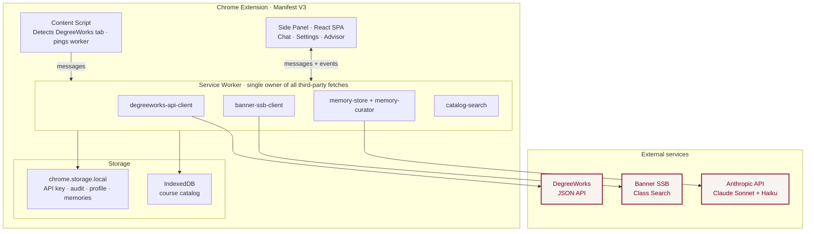

# Fordham Registration Helper

> An AI academic advisor that lives inside Fordham's DegreeWorks portal. Chat with Claude about your degree requirements, grounded in your real audit and live Banner course catalog — with natural-language course search, requirement-aware recommendations, and long-term memory across sessions.

A Chrome extension (Manifest V3) that embeds a Claude-powered advisor as a side panel, reading the live DegreeWorks audit via the vendor JSON API and querying Banner SSB for current section data. Submitted to the **Fordham AI Solutions Challenge 2026** by Team Gradient.

---

## Quick start

**Prerequisites:** Node 18+, Chrome with Developer mode, a Fordham DegreeWorks login, and an [Anthropic API key](https://console.anthropic.com).

```bash
git clone https://github.com/NickTrinh/registration-agent
cd registration-agent
npm install
npm run build     # → dist/
```

In Chrome:

1. Open `chrome://extensions`, toggle **Developer mode** on, click **Load unpacked**, and select `dist/`.
2. Pin the extension; open [DegreeWorks](https://dw-prod.ec.fordham.edu/responsiveDashboard/worksheets/WEB31) and log in.
3. Click the extension icon → **Settings** → paste your Anthropic API key.
4. **Settings → Course Catalog** → pick a term → Refresh (~30–60s).
5. Switch to the **Advisor** tab and start chatting.

> Use `npm run build`, not `npm run dev`. Vite's HMR client is blocked from the extension origin by Chrome's CORS rules.

For a guided tour of the feature set (onboarding, course search, what-if audits, memory recall, forget + save commands), see [`notes/TESTING.md`](notes/TESTING.md).

---

## Architecture



Four design properties the codebase holds to, each backed by an ADR:

- **The service worker owns every third-party fetch** (DegreeWorks, Banner, Anthropic). Content scripts are thin taps. [ADR 0003](notes/decisions/0003-service-worker-owns-api-calls.md) · [ADR 0016](notes/decisions/0016-cors-carveout-for-whatif-proxy.md)
- **PII never crosses the Anthropic wire.** The audit-to-text renderer emits `[NAME]` / `[ADVISOR]` / `[ADVISOR_EMAIL]` placeholder tokens; the sidebar substitutes real values client-side at render time. [ADR 0009](notes/decisions/0009-pii-boundary-at-renderer.md)
- **Memory is paged, not injected.** Sonnet sees a routing index (one line per memory); full content loads on demand via `recall_memory`. Two-tier curator — hard facts save immediately; soft signals accumulate and promote at threshold. [ADRs 0011–0013](notes/decisions/)
- **Prompt caching on the system prompt** gives ~90% input-token savings from turn 2 onward. [ADR 0010](notes/decisions/0010-prompt-caching-at-system-breakpoint.md)

---

## Architecture decisions

Every shaping decision is captured as an ADR under [`notes/decisions/`](notes/decisions/). Each record states the problem, the choice, the alternatives rejected (and why), and the consequences. Read them in numerical order for the full arc, or jump to one by topic:

| # | Title |
|---|-------|
| [0001](notes/decisions/0001-fork-registration-helper-drop-python.md) | Fork NickTrinh/registration-helper; drop the Python approach |
| [0002](notes/decisions/0002-degreeworks-json-api-not-html-scraping.md) | Use DegreeWorks JSON API, not HTML scraping |
| [0003](notes/decisions/0003-service-worker-owns-api-calls.md) | Service worker owns all third-party API calls · Amended by 0016 |
| [0004](notes/decisions/0004-cookie-auth-credentials-include.md) | Cookie-based auth via `credentials: "include"` |
| [0005](notes/decisions/0005-dispatch-on-symbolic-name-not-numeric-nodetype.md) | Dispatch on symbolic `.name` / `.ruleType`, not numeric `nodeType` |
| [0006](notes/decisions/0006-unified-post-audit-for-whatif-and-lookahead.md) | Unified POST `/api/audit` for What-If and Look-Ahead |
| [0007](notes/decisions/0007-reverse-map-attribute-taxonomy-from-rule-tree.md) | Reverse-map ATTRIBUTE taxonomy from the audit rule tree |
| [0008](notes/decisions/0008-banner-term-bind-and-term-wide-pagination.md) | Banner session-bind dance + term-wide pagination |
| [0009](notes/decisions/0009-pii-boundary-at-renderer.md) | Safe-by-construction PII boundary at the audit-to-text renderer |
| [0010](notes/decisions/0010-prompt-caching-at-system-breakpoint.md) | Prompt caching at the system-prompt breakpoint |
| [0011](notes/decisions/0011-background-extractor-memory-curator.md) | Background-extractor memory curator · Extended by 0013 |
| [0012](notes/decisions/0012-routing-table-memory-index.md) | Routing-table memory index with `recall_memory` tool |
| [0013](notes/decisions/0013-two-tier-memory-curator.md) | Two-tier memory curator · Revisited 2026-04-17 |
| [0014](notes/decisions/0014-onboarding-intake-mode.md) | Onboarding intake mode with `save_memory` tool · Revisited 2026-04-18 |
| [0015](notes/decisions/0015-memory-source-attribution.md) | Memory source attribution (verbatim "you said: ..." quotes) |
| [0016](notes/decisions/0016-cors-carveout-for-whatif-proxy.md) | CORS carveout: proxy What-If POST through the DegreeWorks tab |
| [0017](notes/decisions/0017-retrospective.md) | Retrospective — what we'd keep, rebuild, and what surprised us |

See [`notes/decisions/README.md`](notes/decisions/README.md) for why the project uses ADRs and how to read them.

---

## Security & privacy

**By design, this extension only accesses data the current student can already see in their own browser.**

- **No credentials stored.** Auth flows through the browser's existing session cookies via `credentials: "include"` ([ADR 0004](notes/decisions/0004-cookie-auth-credentials-include.md)).
- **No PII sent to Anthropic.** Banner ID, full name, advisor name, and advisor email are stripped at the renderer ([ADR 0009](notes/decisions/0009-pii-boundary-at-renderer.md)).
- **No server-side storage.** All data lives in the student's browser (`chrome.storage.local` + IndexedDB). Nothing is transmitted anywhere except Anthropic (audit text + conversation) and Fordham's own endpoints.
- **No bulk scraping or access to other students' data.** Every API call is one a student's browser would already make during normal use. Banner catalog refresh is rate-limited to 150 ms between pages ([ADR 0008](notes/decisions/0008-banner-term-bind-and-term-wide-pagination.md)).
- **No background automation.** User-driven only — no polling, no scheduled jobs.
- **For use with your own Fordham account.** The extension runs against the student's own browser session and their own Anthropic API key. Not affiliated with Fordham IT or Ellucian.

---

## Tech stack

**TypeScript** (strict) · **React 18** · **Tailwind CSS** · **Vite 5** with `@crxjs/vite-plugin` · **Chrome Extension MV3** (service worker, side panel, content script) · **`@anthropic-ai/sdk`** (Sonnet 4.6 for chat, Haiku 4.5 for the memory curator) · **IndexedDB** via `idb` for the catalog · **`chrome.storage.local`** for API key, audit, profile, and memories.

**Live data sources:** Fordham DegreeWorks JSON API (`dw-prod.ec.fordham.edu/responsiveDashboard/api/*`) + Fordham Banner SSB Class Search (`reg-prod.ec.fordham.edu/StudentRegistrationSsb/ssb/*`).

---

## Repository layout

```
registration-agent/
├── README.md
├── manifest.json                         # Chrome MV3 manifest
├── package.json                          # npm scripts + deps
├── notes/
│   ├── TESTING.md                        # demo walkthrough
│   ├── degreeworks-api-reference.md      # reverse-engineered Ellucian DegreeWorks JSON API reference
│   └── decisions/                        # 17 ADRs — the reasoning behind every shaping decision
└── src/
    ├── background/                       # service worker (orchestrator + API clients + memory + curator)
    ├── content/                          # content script (~10 lines, pings the worker on DW load)
    ├── sidebar/                          # React side-panel UI (Advisor + Settings pages)
    └── shared/                           # types, IndexedDB wrapper, cross-surface utilities
```

Every source file that implements an ADR carries a `// Implements: ADR NNNN` header. Run `grep -rn "Implements: ADR 0013" src/` to find the full code surface of any decision.

---

## Team

**Team Gradient** — [@NickTrinh](https://github.com/NickTrinh), [@pqtch](https://github.com/pqtch), [@BlazedDonuts](https://github.com/BlazedDonuts). Upstream scaffold by @NickTrinh.

---

## License

TBD.
